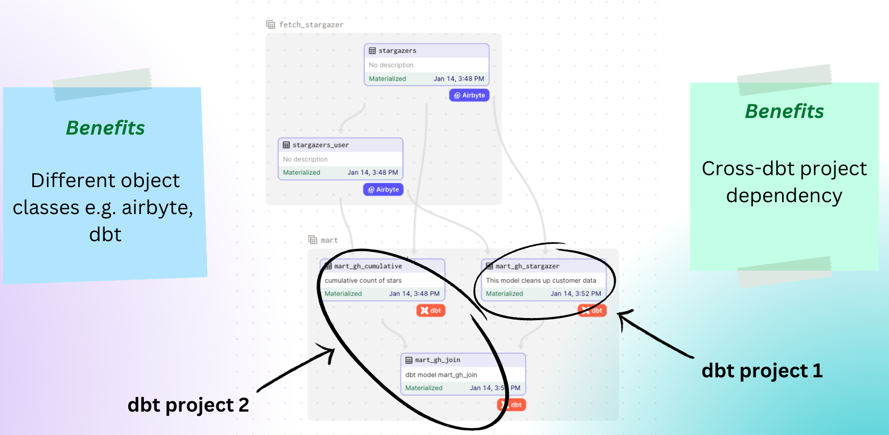

# Data-aware orchestration demo 

This project demonstrates dagster's data-aware orchestration capability. 

This project has the following assets to orchestrate: 
1. An [airbyte](https://airbyte.com/) connection 
1. Two [dbt](https://www.getdbt.com/) projects 



This project forks code from a demo prepared by [airbytehq's open-data-stack repo](https://github.com/airbytehq/open-data-stack/tree/main/dagster), and adds additional code to demonstrate newer concepts. 

### Concepts demonstrated: 

- **dbt cross-project lineage**: dagster's ability to create a global dependency graph between different dbt projects. This is currently [not available in dbt](https://github.com/dbt-labs/dbt-core/discussions/5244). 
- **Object-level dependencies between different assets**: dagster's ability to create object-level dependencies between different assets like an airbyte table materialization, and a dbt model materialization. 
- **Freshness policy triggers**: Most data orchestration tools use cron schedules to trigger an entire DAG. Dagster reverses this approach and allows developers to define freshness policies on nodes so that upstream nodes can be triggered to deliver data to the target node on time. 

# Getting started 

## Set up virtual environment 

A [Pipfile](./Pipfile) has been provided for use with [pipenv](https://pipenv.pypa.io/en/latest/) to define the python version to use for this virtual environment. 

Assuming you already have pipenv installed, to launch the virtual environment for this project, run the following commands: 

```bash
cd my-dbt-dagster
pipenv shell 
```

If you wish to instead use your local python installation, just make sure that it is at least python 3.8 and above. 

## Install python dependencies 

To install the python dependencies, run: 

```bash
cd stargazer
pip install -e ".[dev]"
```

## Set up local Postgres

We'll use a local postgres instance as the destination for our data. You can imagine the "destination" as a data warehouse (something like Snowflake).

To get a postgres instance with the required source and destination databases running on your machine, you can run:

```bash
docker pull postgres
docker run --name local-postgres -p 5433:5432 -e POSTGRES_PASSWORD=postgres -d postgres
```

Note: I am mapping local port 5433 to the container's port 5432 as my local port 5432 is already in use. 

## Set up Airbyte

Now, you'll want to get Airbyte running locally. The full instructions can be found [here](https://docs.airbyte.com/deploying-airbyte/local-deployment). 

The steps are pretty simple. Run the following in a new terminal: 

```bash
git clone https://github.com/airbytehq/airbyte.git
cd airbyte
docker-compose up
```

This should take a couple of minutes to pull the images and run them. 

## Set up airbyte connection

Now that airbyte is running locally, let's create the source, destination, and connection for a data integration pipeline on airbyte. 

First we set the environment variables we need: 

```bash
export AIRBYTE_PASSWORD=password
export AIRBYTE_PERSONAL_GITHUB_TOKEN=<your-token-goes-here>
```
Note: 
- The default password for airbyte is `password`. 
- We'll need to [create](https://github.com/settings/tokens) a token `AIRBYTE_PERSONAL_GITHUB_TOKEN` for fetching the stargazers from the public repositories.

After setting the environment variables, we can check if we have everything we need to let dagster create the airbyte source, destination, and connection by running: 

```bash
cd stargazer
dagster-me check --module assets_modern_data_stack.my_asset:airbyte_reconciler
```

This will print out the assets that dagster will create in airbyte. For example: 

```
+ fetch_stargazer:
  + source: gh_awesome_de_list
  + normalize data: True
  + destination: postgres
  + destination namespace: SAME_AS_SOURCE
  + streams:
    + stargazers:
      + destinationSyncMode: append_dedup
      + syncMode: incremental
```

If you are happy with those assets being created in airbyte, then run the following to apply it: 

```bash
dagster-me apply --module assets_modern_data_stack.my_asset:airbyte_reconciler
```

## Set up dbt

We have 2 dbt projects in the [stargazer](./stargazer/) folder: 

- [dbt_project_1](./stargazer/dbt_project_1/)
- [dbt_project_2](./stargazer/dbt_project_2/)

Install the dbt dependencies required by both projects by running:

```bash
cd stargazer/dbt_project_1
dbt deps 
```

```bash
cd stargazer/dbt_project_2
dbt deps 
```

## Start dagster 

We're now ready to get dagster started. Dagster has two services that we need to run: 
- [dagit](https://docs.dagster.io/concepts/dagit/dagit): The web-based interface for viewing and interacting with Dagster objects.
- [dagster daemon](https://docs.dagster.io/deployment/dagster-daemon): The service that manages schdeules, sensors, and run queuing. 

For both services to communicate and have shared resources with one another, we need to create a shared directory:

```bash 
mkdir ~"/dagster_home"
```

We named our shared directory as `dagster_home` for simplicity. 

To run the dagster daemon service, create a new terminal and run: 

```bash
export DAGSTER_HOME=~"/dagster_home"
export AIRBYTE_PASSWORD=password
export POSTGRES_PASSWORD=postgres
dagster-daemon run -m assets_modern_data_stack.my_asset
```

To run the dagit service, create a new terminal and run: 

```bash
export DAGSTER_HOME=~"/dagster_home"
export AIRBYTE_PASSWORD=password
export POSTGRES_PASSWORD=postgres
dagit -m assets_modern_data_stack.my_asset
```

Launch the dagit UI by going to [http://localhost:3000/](http://localhost:3000/). 

You'll see the assets of airbyte, dbt that are created automatically in this demo.


Activate the schedule: 


Activate the sensor: 


# Interact with dagster 

Now you can sit back and watch the [global asset lineage](http://localhost:3000/asset-groups/) trigger based on the schedule and/or sensor trigger. 

You'll notice the following behaviours: 

1. The airbyte assets will materialize every 30 minutes based on a schedule. 


2. The two dbt projects [dbt_project_1](./stargazer/dbt_project_1/) and [dbt_project_2](./stargazer/dbt_project_2/), are now seen as part of the same global asset lineage in dagster without any separation between dbt projects. 


3. `mart_gh_cumulative` will materialize every 5 minutes because it's dbt model [mart_gh_cumulative.sql](stargazer/dbt_project_2/models/mart/mart_gh_cumulative.sql) has a freshness policy of `dagster_freshness_policy={"maximum_lag_minutes": 5}`. This in turn will also trigger the airbyte assets to be materialized first. 


4. `mart_gh_join` will materialize every 10 minutes because it's dbt model [mart_gh_join.sql](stargazer/dbt_project_2/models/mart/mart_gh_join.sql) has a freshness policy of `dagster_freshness_policy={"maximum_lag_minutes": 10}`. This in turn will also trigger it's upstream assets to be materialized if it hasn't already. 


5. `mart_gh_stargazer` will materialize every 10 minutes because it needs to do so to keep `mart_gh_join` fresh. It's dbt model [mart_gh_stargazer.sql](stargazer/dbt_project_1/models/mart/mart_gh_stargazer.sql) does not have a freshness policy.


